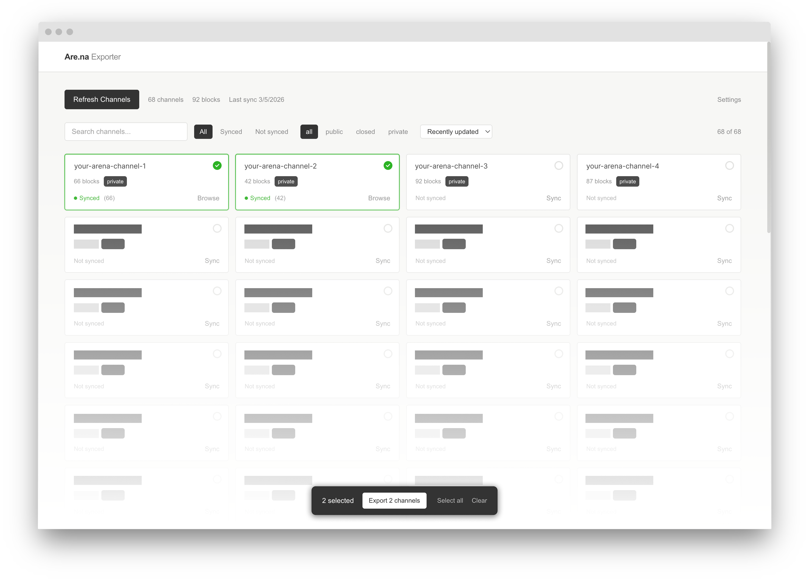

# Are.na Exporter



A local tool to sync your Are.na channels and export blocks as CSV, JSON, or SQLite.

Everything runs in your browser. Your data is stored locally using [IndexedDB](https://developer.mozilla.org/en-US/docs/Web/API/IndexedDB_API) and is never sent to any external server. There is no backend.

## How It Works

1. **Sync** — Fetches your channels and blocks from the [Are.na API](https://dev.are.na/documentation) into your browser's local storage
2. **Browse** — View your synced channels and blocks in an Are.na-styled interface
3. **Export** — Select channels, filter by date, pick fields, and download as CSV, JSON, or SQLite

## Setup

```bash
# Install dependencies
bun install

# Start dev server
bun run dev
```

You'll need:

- **Are.na User Slug** — your username from your profile URL
- **Are.na Access Token** — a personal token used to authenticate with the [Are.na API](https://www.are.na/developers/explore). Get one from [dev.are.na/oauth/applications](https://dev.are.na/oauth/applications/new)

Both are saved in your browser's [`localStorage`](https://developer.mozilla.org/en-US/docs/Web/API/Window/localStorage) and configured in the Dashboard settings.

## Stack

Built with [Vite](https://vite.dev) + [React](https://react.dev) + [Tailwind CSS](https://tailwindcss.com), using [IndexedDB](https://developer.mozilla.org/en-US/docs/Web/API/IndexedDB_API) via [idb](https://github.com/jakearchibald/idb) for storage and [sql.js](https://sql.js.org) ([WebAssembly](https://developer.mozilla.org/en-US/docs/WebAssembly)) for SQLite export.

## Contributing

This project is open source — issues and PRs welcome at [github.com/yz3440/arena-exporter](https://github.com/yz3440/arena-exporter).
